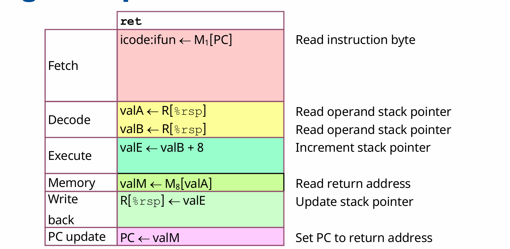
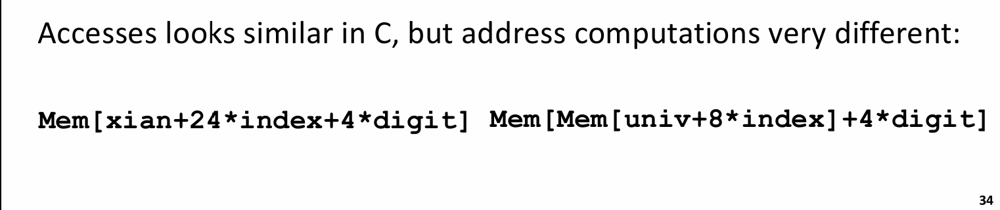
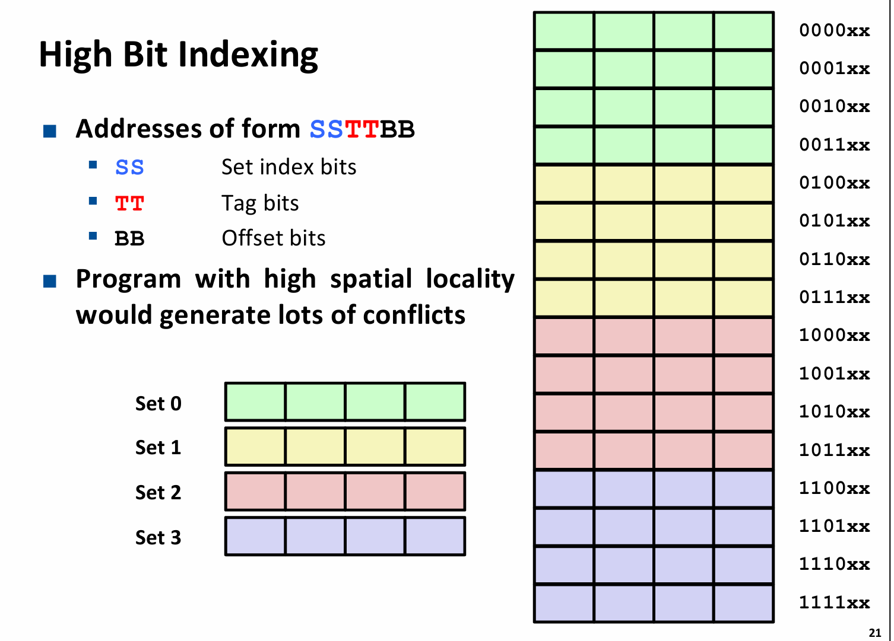
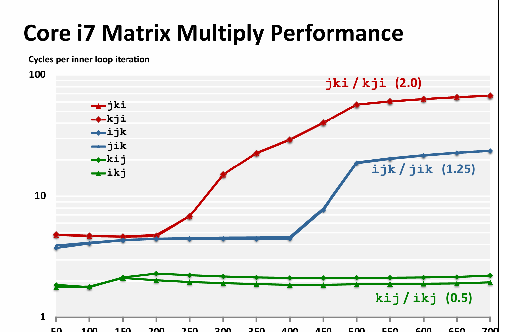
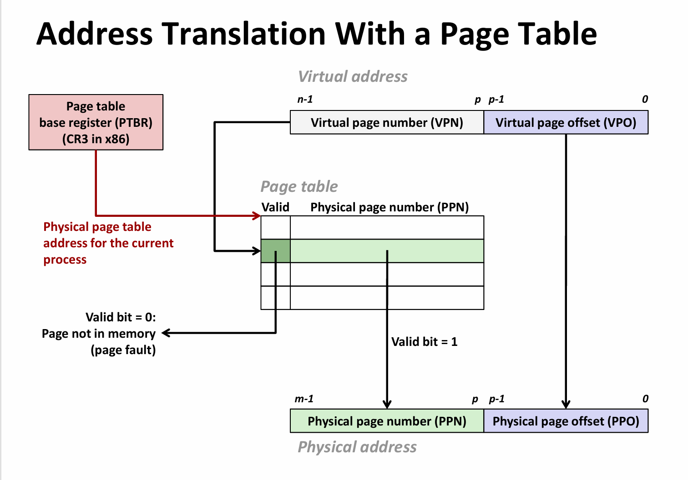
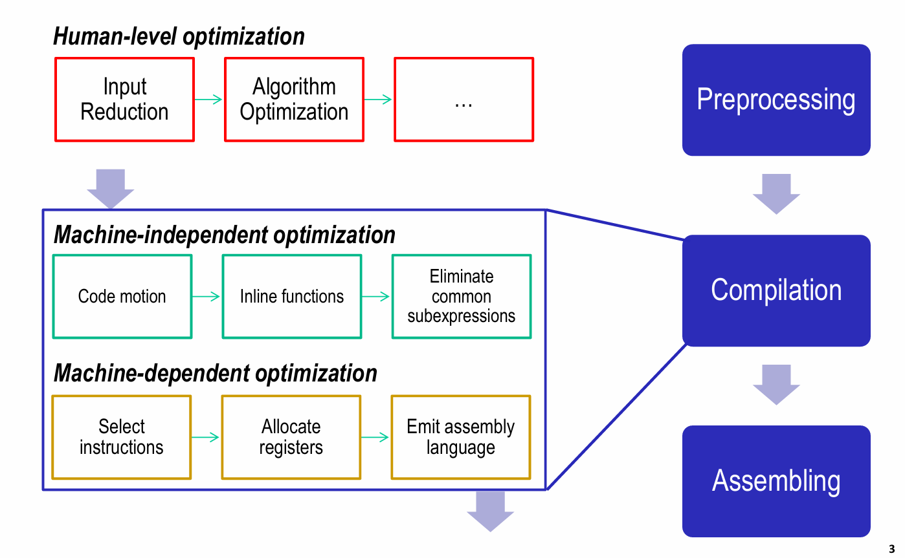

# ICS复习

# x86-64汇编

[Lecture 2 Machine-level Programming I: Basics](https://www.notion.so/Lecture-2-Machine-level-Programming-I-Basics-1a5afb9c42bd80fda297f6421b6df97d?pvs=21)

### 对以上记录先进行评述：

1.结构体之中的内存对齐，每个结构体成员的首地址是其大小的整数倍，结构体首地址是其成员最大的那个类型的整数倍；

1. 指令集架构

是硬件和软件的界面，指令，数据类型（x86-64的整型8位、16位、32位、64位），寄存器堆，寻址模式；

寄存器中特殊的寄存器：RSP（储存当前栈顶地址，ret,call等指令时有用），RIP(PC指向下一条指令的地址)，x86-64有16个通用寄存器。

x86-64的操作数包括寄存器类型、内存地址类型（由寄存器存入的地址确定），立即数；

我顺带复习了CPU体系中的顺序CPU指令，有一些指令是2字节指令，首字节的前4位是instruction code 向CPU说明该指令的类型，后四位是function code,具体指示该指令的功能；接下来一个字节前4位是S寄存器，后四位是D寄存器；

 

<aside>
💡

复习了Linux下的指令含义，举两个特殊一点的：

subq %rax,%rsp           含义是rsp寄存器减rax,并将结果存在rsp中

cmpq %rax,%rbx           后者与前者相比

</aside>

从汇编层面上来看，操作包括：move,基本运算和位运算，比较运算；jump和ret(其中包括了栈操作)

汇编代码中的寻址模式：直接寻址：(%rsp)，基址寻址 : 8(%rsp), PC相对寻址：0x2323(%rip);    index+base寻址 ： (%rdi,4)

## 一个可能作为考点的指令？

leaq S,D(其中S是地址的计算，D指示计算后值的存储寄存器)

```c
leaq (%rdi, %rsi, 4), %rax  ; RAX = RDI + RSI*4（用于数组索引计算）
//地址计算的括号前还可以加上偏移量
```

## Machine programming 控制部分

1. 自主回忆

在汇编中，程序的非顺序执行是由一些指令如jmp,ret，call来完成的，这两个指令是无条件跳转的，jump指令和call指令本身带有跳转的地址，而ret指令比较特殊，它的完成是由以下步骤完成：



同时CPU当前的状态可以反映在条件码上，条件码是经过基本运算后会被隐式地操作，比如addq ，subq ,等指令；还有两个指令test (相当于与操作，但不改变D寄存器的值)；cmp a,b (相当于b-a,同样不改变b的值)，但是会在过程中设置条件码。

还有一些指令是根据条件码进行操作的，比如setx ,它操作寄存器的最低字节但不改变其他，同时还有一个指令movzbl 这个指令将单字节扩展到2字，即32位，将多出来的三个字节全部置零；这里还有一个隐藏的操作，就是在64位机上，如果操作了eax等32位寄存器，会将高位的32位全部置零。

还有一些指令是根据条件码进行操作的，比如je,  ja,jb(针对unsigned),jg,jl(针对signed)

## 条件跳转

在c语言等高级语言上实现的if,else 在汇编上通过jmp,jl,等实现；程序此时不再是顺序执行的，而是出现了非线性的情况，有两条可能的路径，所以一旦CPU在分支预测上出现错误，它就必须重新执行；

如果两条分支的功能不复杂，比如是一个单指令操作，完全可以通过条件转移（condition move）来实现，即同时执行两条路，再判断，然后选择结果。这样的好处是规避了分支预测错误的惩罚，但是不适用于那些在两条分支有复杂的逻辑，或者两条分支共同操作同一操作数的场景。

## 循环的实现

循环的本质是跳回之前的代码；可以用goto来等效实现；

将循环的代码标注为loop代码段，do-while本质上实现了

```c
loop:

body

test:if()

goto loop;

else

return;
```

而for或者while语句也可以通过翻译为do while来实现

## switch case的实现

有两种实现方式，第一种是直接跳转。首先，各种case可以看做是不同的代码块；这些代码块可能有一些特殊情况，比如直通，或者是重复使用某一代码块，直通可以在代码块间使用jump来实现；重复就更简单了；

另一种是间接跳转，存在一个跳转表，在rodata段，它类似于一个地址数组，需要先获得跳转到哪条地址；

## 函数调用和栈操作

几个特殊指令：call ret

栈的两个基本操作push和pop
注意栈向低地址方向增长；即push时栈顶指针减，pop时栈顶指针加

call :该指令提供被调用函数的地址，用这个地址更新pc,同时压栈，把该指令的下一条地址压入栈中；

ret: 该指令与call进行相反的操作，先从栈中弹出来地址（8字节）更新rip寄存器（PC）；

### 如何传参

对于x86-64，前6个参数由寄存器传；如果有放不下的（结构体）或者参数过多的，就压入栈中进行传参；特殊地，一般由rax寄存器来传函数的返回值；

传参的过程发生在call指令之后

### 内存管理

由于计算的结果一般传在通用寄存器上，而寄存器又是各函数公用的；所以有caller和callee两种维护局部变量的方式；一般rax,rdi等大多数通用寄存器都是caller save；而rsp,rbp,rbx，r12等少数几个寄存器是callee save的；

### 递归

在汇编层面上递归的实现并不特殊

只要通过一个call myself 就可以实现；但要避免无法跳出导致栈溢出

## machine programming 数据

### 数组的实现

1维数组：比如1个字符串；如果它是作为局部变量的话，它的创建过程是rsp-sizeof array;然后再向其中逐字节写入，从栈顶开始写；

如果我要访问整型数组的一个元素：汇编层面是：base+index*s;

```nasm
leaq (%rdi,%rax,4), %rsi;
```

在C语言中，变量名就是该数组的首地址，可以作为参数传入；

二维数组：本质上也是一片连续的内存空间，其又可以理解成数组的嵌套；

比如一个数组 a[3][4];假设是行先序；在内存中的排列是几个行向量的连续排列，也就可以理解为行向量的数组，即

```c
typedef int MYTYPE [8];
MYTYPE xjtu[4]={{1,2,3,4,5,6,7,8},{1,2,3,4,5,6,7,8},{1,2,3,4,5,6,7,8},{1,2,3,4,5,6,7,8}};
```

在汇编层面，访问二维数组的操作可以看做访问这样一个嵌套数组，即先获取内部数组的大小，再作为leaq指令中的比例因子；比如上面这个例子中内部数组的大小为8*4=32；那么可以使用leaq (base,index,32)来访问某一个行向量，再对这个行向量进行类似于1维数组的操作，就可以获得所需要的数组元素；

在逻辑上，访问二维数组a[3][4]的元素a[i][j],就是访问地址a+i*4*sizeof(data)+sizeof(data)*j;

<aside>
💡

但是实际上，嵌套数组和二维数组可能是不同的，只有在嵌套数组内存连续分布时，才可以看做是类似的二维数组；在汇编层面上，嵌套数组使用了另一片内存空间来存储各地址。而这个存地址的数组，各元素的大小显然是指针的大小。

</aside>



### 结构体和字节对齐

编译器会为结构体各成员安排一个固定的偏移量，并且为结构体固定一个大小，这个大小和结构体的首地址都是结构体最大成员的大小的整数倍；结构体各成员的地址也是sizeof(data)的整数倍，但要注意，数组成员的大小是其元素的大小而非整个数组的大小；

## 栈溢出的风险和应用

栈溢出的风险，攻击：面向返回值的攻击和缓冲区修改；

缓冲区：修改返回地址，或者将返回地址改为栈上地址，再在栈上执行代码；

面向返回值：利用代码区中与c3(ret指令)接近的机器码，可以构造出一条不断执行的链条，并利用其为函数调用准备参数，最后进行函数调用；

也可以利用以上的两个漏洞使函数执行出一些意想不到的结果；

# 计算机存储结构

在计算机CPU主频不断提高，有效CPU周期不断降低时，DRAM与CPU的gap不断增大；出现的新技术SRAM等单位内存又价格更高；

构建一个存储结构，为一个金字塔形，从最底下容量最大、速度最慢的硬盘到DRAM再到三级缓存，再到寄存器；在容量更小的同时，速度更快；上面的一层是下面存储结构的子集；上面也可以叫做下面一层的cache，这是广义的cache.

<aside>
💡

PPT中的一个细节：有效时钟周期和实际时钟周期；随着主频的不断提高，功耗越来越大，发热严重；工程师走出了不同的路径进行优化：多核并行、流水线、超标量，这些操作并没有改变硬件上计算机的实际时钟周期，但是却能够提高执行一条指令的平均时钟周期。

</aside>

## Cache

为了补齐gap,现代计算机普遍都有3级cache,L1分指令和数据，L2L3均为通用，L3为多核公用；

1. 怎么读？
    
    最优情况（但因为硬件电路限制难以实现）全相联，只用一个set,放有n个大小的block，每个内存块之间用tag区分；这种情况避免了conflict miss 的出现；具体来看，假设实际内存有6位，即主存总大小为64 byte,16 byte 的cache 大小，且每个block大小为4字节，那么就需要4个block,各组通过tag位加以区分，每次读取时，先判断是否valid，再判断tag是否匹配；两个条件均满足就是hit,否则miss.注意硬件电路实现的是并行比较和判断，这也就解释了为什么全相联难以实现，即需要比较16个block的tag和某个值；
    
    最差情况（direct-map）,还是已知64byte的主存大小，16 byte 的cache 大小，且每个block 4个byte，那么总共就需要4组（16/4），那么一个内存就可以被分为前两位（Tag）,中间两位（index）,剩余两位（offset）;在读取时，先找set是哪个，再比较tag和valid,最后根据offset拿到具体的内存地址上的值。
    
    折中方案：多路组相联；设置每个set不止一组，就可以在一定程度上降低它的conflict miss的概率；每次也是先找index，再对tag;  (一组上的各个block也叫cache line)
    
2. 怎么写？
    
    一般采用写分配和写回两个策略结合，这两个策略分别对应miss和hit;
    
    写回（write through）是如果在写的时候hit了，就给当前的cache写一个dirty位，先不着急写回，直到这个块要被替换时再将其写回；
    
    写分配（write allocate）是如果写的时候miss了，那当然要在低一级的cache中找找，直至找到它后，再把它写回高一级的cache(越接近CPU认为级别越高)；
    
    那么，会出现一种很麻烦的情况：当我想写一个内存时，L1 miss, L2 miss，L3 hit, 把对应的块写分配给L2，发现没有空余位置，于是替换，又发现替换的那个是一个dirty位为1的，那还得先把它写回L3 ，（如果L3又没位置，还是要进行一样的替换操作）；数据写到L2，再找L1中的空闲位置，如果又是没位置，还得换，又要考虑写回的事情；直到把这块内存写到L1，再将dirty位置1。
    
    在cache lab 实验中，使用了这样的包含性策略来实现一个三级cache，这个包含性策略要求高一级的cache必须是低一级的子集，不能出现：某内存存在于L1，但在L2中没有。这种策略同时也保证了写回是100% hit 的。这样的包含性策略还默认了写操作总是在L1上进行的，如果L1 miss，就先加载到L1，再写。
    
3. 为什么index是在中间而非在最前面？
    
    这实际上是为了避免因为“良好的空间局部性”导致过多的conflict miss,注意到在index设置在高位时，几个连续的主存块都被映射到同一内存块。
    
    
    
4. 为什么cache是有效的？
    
    时间局部性和空间局部性原理，一个良好的程序通常会对一个数据（指令）多次访问，或者对一块连续的内存（指令）进行访问；cache取出的数据，很有可能下次还会被访问，它附近的数据也还可能会被访问；那么访存的速度，就从原来访存DRAM的速度变为了访存 SRAM 的速度.
    
5. 一个结论：矩阵乘法的良好顺序是 kij 或者 ikj 
    
    
    

# 虚拟内存

虚拟内存和cache的实现具有一定的相似性，其目的也有相似性：磁盘和内存间ms级的延迟是难以接受的；通过虚拟内存实现了对主存的高效利用；

同时，虚拟内存不止实现了主存和磁盘之间的缓存关系，还作为了储存器管理和保护的工具；

具体来讲，虚拟内存可以为每个进程设置一个很大且线性的内存空间，同时又保证了各进程的物理内存不冲突；也避免了对主存利用的碎片化；

通过页表管理内存，也使得某些内存得以被共享；更为重要的是虚拟内存实现了链接和加载的简化，因为在虚拟内存的视角，代码区的起始位置，栈的起始位置都是被固定的；

虚拟内存还实现了对存储器的保护，我可以设置页表某些项为可读、可写、可执行来控制对这些虚拟页面的访问；

## 地址翻译

地址的翻译是由软硬件共同协作完成的。

硬件上，芯片中的MMU接收CPU提供的虚拟地址VP，先查找快表TLB，TLB是一个类似于cache的多路组相联结构，其中存储了最近访问的页表项，根据局部性原理，TLB的miss率相对较低，这是因为每个页表项对应着4k的页，假设TLB仅存在一条页表项，每1000次会换一次表，那么miss率应该是1/1000，因而多数时候，仅通过TLB就可以获得对应的物理地址。

上面的内容并没有解释全面，接下来先说页表及其访问，再说明完整的机制实现过程。

当TLB miss 时，MMU会根据页表基址寄存器提供的页表基址的物理地址（讨论先假设是一级页表）+VPN（是VP的一部分）获得对应的页表项，这里面存储了PPN，利用PPN和VPO（它也是物理页的偏移量）拼起来，就得到了物理地址PP，接下来就可以套用cache的访问来进行了，即先访问L1 cache….



以上讨论只说明了页表的hit的情况，当查找不到对应表项（即valid是0），有以下几种情况：

1. 这是一个错误地址，比如数组越界，比如访问一个没有声明的指针等，触发段错误，导致进程终止；
2. 由于按需分配的机制，分配的内存并没有立即拉入主存，直至第一次访问时，触发page fault，操作系统会处理这个错误，如果主存未满，则分配空闲页，如果主存已满，就选择一个victim换入swap区，再分配腾出来的内存；
3. 如果访问的内存是被换到了swap区，那就将其换回。

从这里也可以看到虚拟内存实现的类似cache的操作，只不过特殊的是，磁盘和主存是一个全相联的关系，即磁盘中的某一页（虚拟内存的某一页）可以被映射到主存中的任何一页。当主存已满时，就进行换出换入。

接下来补充TLB的内容，由于TLB是一个组相联的类似于cache的结构，对它的访问，是将VPN拆成TLBt,TLBi,也就是tag和index，查找和cache类似。

<aside>
💡

一个疑问：在PPT中和书中，都有一个观点，就是如果这个虚拟内存被分配，那么它就对应磁盘中的一个页。这种观点有合理性：如果是新分配的，并非文件，可以把其看做是磁盘中的匿名文件（二进制全零），当其第一次被访问时，实际上磁盘与主存并没有发生IO交互，但是可以想象成一个匿名文件被换入内存；如果就是一个文件，那么它也是按需调度，当第一次引用到该页面时，触发页中断，os将该页加入内存中；应用程序也可以使用函数mmap,来将磁盘文件映射到虚拟内存上；

</aside>

多级页表：虽然单级页表能够快速查找到物理地址，但由于现代计算机的地址空间很大，在主存上根本无法存储如此多进程的如此多页表，那么就使用多级页表作为妥协，多级页表可以省空间的原因是如果某一块是空的话，就设定其指向的指针为NULL，那么这一块所有的页表项都不用存储了。

# 优化

machine independent 优化

code move （把重复的操作移出循环）、为指针操作创建别名，即临时变量，防止编译器对内存的大量读写， 死代码消除、内联函数

我们为什么要这么做？ 编译器的优化有限，在可能出现问题时，它的操作是保守的；

为什么叫做机器独立优化？ 这些优化操作是不需要硬件的特殊机制做支撑的。

## Machine dependent 优化



机器依赖的优化上，主要有流水线，并行化，分支预测等；

流水线把单个机器指令的实现拆解成几个部分，在某个数据第i个stage处理完之后，就可以将下一个数据送入，这样的流水线在顺畅运行的情况下可以将CPE减小到1；这是因为在流水线充分运转时，每个周期都有数据运算完成；通过多条流水线的共同运行，CPE可以继续减小，这就需要硬件计算单元数量的增加，注意，这样的增加受限于流水线过程中数量最少的那个单元。

为了充分利用机器的性能，常见的处理方式是扩大并行，即使用循环展开。

## 链接

1. 符号解析：将所有引用绑定到唯一的定义上，定义分为强、弱，初始化的或者已经写好的函数是强定义，未初始化的变量或者函数的声明是弱定义；不能存在两个强定义的全局变量或者函数；当存在两个弱定义的全局变量时，链接器任选一个作为声明；当存在多个弱定义和一个强定义时，弱定义指向强定义；
2. 重定位：链接器先为合并的目标文件的所有段确定虚拟地址，然后利用重定位表，将每一个表项（text段或者data段）一般是地址或者全局变量值，进行确定；地址可以使用绝对地址和PC寻址；
3. 静态链接：静态库.a文件是将很多个.o文件进行打包得到的库，链接器对可执行文件和该库进行链接时，从函数参数的第一个开始查找，那么就要注意把库放在引用库的可执行文件的后面；
4. 动态链接：动态链接的重定位过程在程序加载或者运行时才得以完全执行；在静态链接阶段，仅拷贝一些重定位表项，当进入加载阶段时，再将动态库加入虚拟内存中，并进行重定位。

## 进程

在单核CPU中，计算机在一个时刻只能运行一个进程，为了实现并发，操作系统使用了一种上下文切换的功能，将CPU的使用分割成不同的时间片，在时间片耗尽后，操作系统负责将寄存器中的值，条件码，PC，等保存在内存中，而把下一个调度的进程相应的值放回寄存器中。

进程的状态：运行、停止、挂起、终止（僵尸）

在linux中，新进程的创建只有fork这一种方式，fork实现了对父进程页表、环境变量、text段、data段、PC的全拷贝，相当于父进程的一个副本。但是一旦fork出一个新进程，两个进程的运行就会独立，看似对同名的变量进行操作，实际上是相互独立的；fork有一个特点，它返回两次，在父进程中返回子进程的pid值，在子进程中返回0；

exit实现进程的终结。不返回；

wait实现对子进程的回收，它是一种阻塞式回收，直到操作系统调度到父进程，并且发现在僵尸进程队列中有其子进程时，父进程执行回收，wait需要一个int 指针，可以接收子进程的返回信息；

waitpid实现对特定子进程的回收；

## 异常控制流

CPU实现的上下文切换的底层就是异常控制流；所谓控制流就是CPU的执行顺序；

异常分为以下几种：1.异步中断；2.同步fault(可恢复)、3系统调用（也叫trap）,4.错误；

后面三种均为同步；

接下来以系统调用为例说明：常见的系统调用比如write、read、fork、exit

在c开发者的角度来看，系统调用的实现和普通函数调用差别不大，但事实上，系统调用：由内核执行，且使用了errno；还有它的权限不同；

trap和中断都会返回下一条语句，但是fault，常见的比如页中断返回到当前语句；

shell的实现：shell进程通过fork创建子进程，再通过execve将原代码段、数据段、栈、堆、页表、寄存器全部“爆破”，加载进新的代码段等；此时父子进程间依然共享环境变量和文件描述符，一个典型的例子是管道实现父子进程的通信；

以shell做因子，我们考虑到一种情况，即需要子进程在后台运行，这就需要signal作为进程间通信的工具，系统有默认的中断处理函数，我们也可以自定义中断处理函数；